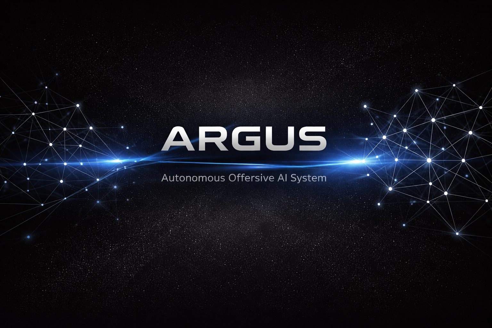

<p align="center">
  
</p>

<p align="center">
  <strong>Autonomous AI pentesting framework — LLM-driven agent with plan trees, attack graphs, and adaptive payloads</strong>
</p>

<p align="center">
  <a href="#quick-start">Quick Start</a> &bull;
  <a href="#agent-mode">Agent Mode</a> &bull;
  <a href="#skill-system">Skills</a> &bull;
  <a href="#commands">Commands</a> &bull;
  <a href="docs/">Documentation</a> &bull;
  <a href="CHANGELOG.md">Changelog</a>
</p>

<p align="center">
  
  
  
  
  
  
  
</p>

---

> **Legal:** For authorized security testing only. Always obtain written permission before scanning any target.

## Quick Start

```bash
# Install (Kali Linux)
git clone https://github.com/cortexc0de/argus-lite.git && cd argus-lite
sudo ./install.sh

# Autonomous agent (recommended)
argus agent example.com

# Pipeline scan
argus scan example.com --preset full

# Docker
docker run -v ./reports:/reports ghcr.io/cortexc0de/argus-lite scan example.com
```

---

## Agent Mode

The LLM acts as a thinking attacker: builds branching plans, chains exploits, scores targets, refines payloads, and learns from experience.

```bash
argus agent example.com                          # autonomous agent
argus agent example.com --multi-agent            # 3-agent team (recon + vuln + exploit)
argus agent example.com --stealth                # slow probing, WAF evasion
argus agent example.com --mission data_exfiltration  # mission-driven goals
argus agent example.com --skills-dir ./my-skills # custom .md skills
```

<details>
<summary><strong>How the Agent Works (click to expand)</strong></summary>

### Plan Tree
LLM builds branching attack strategies, not a linear list. Agent always picks the highest-confidence pending node:

```
Goal: "Find data access vulnerabilities"
├── Branch A: API testing (confidence=0.9)
│   ├── scan_sqli /api/user?id=    [pending]
│   └── test_payload custom bypass [pending]
└── Branch B: Auth bypass (confidence=0.6)
    ├── check_headers              [completed]
    └── scan_nuclei /login         [pending]
```

### Attack Graph
Findings connect into exploit chains with probability edges:

```
XSS in /search ──→ Session Hijack (p=0.6)
SQLi in /api ─────→ Database Access (p=0.8)
Missing CSRF ─────→ Clickjacking (p=0.3)
```

### Target Scoring
Endpoints prioritized before execution:

```
CRITICAL  /admin            → auth_bypass, IDOR
HIGH      /api/user?id=123  → IDOR, SQLi
MEDIUM    /search?q=test    → XSS, SQLi
SKIP      /static/style.css
```

### Adaptive Payloads
Each attempt feeds back to LLM for WAF bypass:

```
Attempt 1: <script>alert(1)</script>  → BLOCKED by WAF
Attempt 2: <ScRiPt>alert(1)</sCrIpT>  → HTTP 200, reflected
```

### Environment Detection
Fingerprints WAF/CDN before attacking. Detects: Cloudflare, ModSecurity, Imperva, Akamai, Sucuri, AWS WAF, F5.

### Mission-Driven Goals (v6)
```bash
argus agent example.com --mission rce
```

```
Mission: rce
  ○ Find command injection (p=0.8)
    ○ Fuzz API parameters   ← next action
  ○ Find file upload bypass (p=0.5)
```

### Knowledge Base (v6)
6 built-in exploit patterns matched to detected tech stack:
- WordPress CSRF chains
- GraphQL introspection → IDOR
- Laravel debug → .env leak
- JWT algorithm confusion
- SSRF via redirect
- File upload bypass

### Meta-Learning (v6)
Tracks skill effectiveness per technology and auto-adjusts strategy:

```
scan_sqli on PHP:   80% success → PRIORITIZE
fuzz_paths on nginx: 10% success → DEPRIORITIZE
```

### Smart Memory
Jaccard similarity finds similar past targets. Reuses payloads that worked on same tech stack.

</details>

---

## Multi-Agent Mode

```bash
argus agent example.com --multi-agent
```

| Agent | Skills | Focus |
|---|---|---|
| **Recon** | subfinder, httpx, katana, whatweb, naabu | Discovery: subdomains, ports, tech |
| **Vuln Scanner** | nuclei, check_headers, ffuf | Detection: known vulns, misconfigs |
| **Exploit** | dalfox, sqlmap, test_payload | Exploitation: XSS, SQLi, custom payloads |

Each agent has its own LLM decision loop. Results flow Recon → Vuln Scanner → Exploit.

---

## Skill System

11 built-in skills + custom `.md` skills:

| Skill | Tool | What it does |
|---|---|---|
| `enumerate_subdomains` | subfinder | Find subdomains |
| `probe_http` | httpx | Check live hosts |
| `crawl_site` | katana | Discover all URLs |
| `scan_nuclei` | nuclei | Template-based vuln scanning |
| `fuzz_paths` | ffuf | Directory brute-force |
| `scan_xss` | dalfox | XSS (reflected, stored, DOM) |
| `scan_sqli` | sqlmap | SQL injection |
| `check_headers` | httpx | Security header analysis |
| `detect_tech` | whatweb | Technology fingerprinting |
| `scan_ports` | naabu | TCP port scanning |
| `test_payload` | httpx | Custom HTTP + reflection detection |

### Custom Skills

Create `.md` files in `~/.argus-lite/skills/`:

```markdown
---
name: check_wordpress
description: WordPress-specific security checks
tools: [nuclei, httpx]
---

1. Probe /wp-admin and /wp-login.php
2. Run nuclei with wordpress tags
3. Check xmlrpc.php exposure
```

See [docs/skills/custom-skills.md](docs/skills/custom-skills.md) for the full guide.

---

## Commands

<details>
<summary><strong>Agent (autonomous)</strong></summary>

```bash
argus agent TARGET                    # autonomous single agent
argus agent TARGET --multi-agent      # 3-agent team
argus agent TARGET --stealth          # slow probing, WAF evasion
argus agent TARGET --max-steps 15     # more iterations
argus agent TARGET --mission rce      # mission-driven goals
argus agent TARGET --skills-dir ./s   # custom skills directory
```
</details>

<details>
<summary><strong>Scan (pipeline)</strong></summary>

```bash
argus scan TARGET --preset full --ai  # full scan + AI analysis
argus scan TARGET --preset quick      # fast (DNS + headers + SSL)
argus scan TARGET --preset web        # web focus (httpx + nuclei + dalfox)
argus scan TARGET --no-cve            # skip CVE lookup
```
</details>

<details>
<summary><strong>Discover (find vulnerable hosts)</strong></summary>

```bash
argus discover --cve CVE-2024-1234    # by CVE across Shodan/Censys/ZoomEye/FOFA
argus discover --tech "WordPress 6.3" # by technology
argus discover --port 3389 --country RU
```
</details>

<details>
<summary><strong>Bulk, Monitor, Dashboard</strong></summary>

```bash
# Bulk (multi-target)
argus bulk targets.txt
argus bulk 192.168.1.0/24
argus bulk --shodan "org:Company"

# Monitor (continuous)
argus monitor example.com --interval 24h --notify

# Dashboard
argus dashboard   # → http://127.0.0.1:8443
```
</details>

---

## Scan Pipeline

```
OSINT:      Shodan, Censys, ZoomEye, FOFA, GreyNoise, VirusTotal, SecurityTrails
  ↓
Recon:      subfinder, dnsx, httpx, katana, gau, tlsx, gowitness
  ↓
Analysis A: naabu (ports), whatweb (tech), headers, SSL
  ↓
Analysis B: nuclei, ffuf
  ↓
Analysis C: dalfox (XSS), sqlmap (SQLi)  ← gf patterns filter URLs first
  ↓
CVE:        NVD API → Correlation Engine → AI Analysis
  ↓
Report:     HTML / JSON / Markdown / SARIF
```

---

## Configuration

<details>
<summary><strong>OSINT API Keys</strong></summary>

```bash
export ARGUS_SHODAN_KEY="..."
export ARGUS_CENSYS_ID="..."
export ARGUS_CENSYS_SECRET="..."
export ARGUS_ZOOMEYE_KEY="..."
export ARGUS_FOFA_EMAIL="..."
export ARGUS_FOFA_KEY="..."
export ARGUS_GREYNOISE_KEY="..."       # optional — community tier is free
export ARGUS_VIRUSTOTAL_KEY="..."
export ARGUS_NVD_KEY="..."             # free, improves CVE rate limit
export ARGUS_AI_KEY="..."              # OpenAI / Ollama / vLLM / any compatible
```

Or configure via `argus config ai` or web Settings.
</details>

<details>
<summary><strong>GitHub Actions</strong></summary>

```yaml
- uses: cortexc0de/argus-lite@v1
  with:
    target: ${{ vars.SCAN_TARGET }}
    preset: quick
    fail-on: HIGH
    output-format: sarif
```
</details>

---

## Project Structure

```
src/argus_lite/
├── cli.py                        # CLI: agent, scan, bulk, discover, monitor
├── core/
│   ├── agent.py                  # PentestAgent (plan tree, attack graph, closed loop)
│   ├── agent_context.py          # PlanTree, AgentContext, AgentResult
│   ├── skills.py                 # 11 skills + SkillRegistry
│   ├── skill_loader.py           # Markdown skill loader (.md → MarkdownSkill)
│   ├── orchestrator.py           # ScanOrchestrator (presets, parallel pipeline)
│   ├── attack_graph.py           # AttackGraph + BFS + Bayesian updates
│   ├── goal_engine.py            # GoalHierarchy, mission-driven planning
│   ├── knowledge_base.py         # Exploit patterns (6 built-in)
│   ├── meta_learning.py          # Self-optimization per skill+tech
│   ├── environment.py            # WAF/CDN detection, StealthConfig
│   ├── payload_engine.py         # Adaptive payload refinement
│   ├── target_scorer.py          # Endpoint prioritization
│   ├── multi_agent.py            # AgentTeam (Recon + Vuln + Exploit)
│   └── config.py                 # AppConfig (Pydantic v2)
├── modules/
│   ├── recon/                    # 10 recon modules + 7 OSINT APIs
│   └── analysis/                 # nuclei, ports, tech, headers, ssl, ffuf, dalfox, sqlmap
├── dashboard/                    # Flask + htmx web UI
└── models/                       # Pydantic data models
```

---

## Documentation

- [Getting Started](docs/getting-started.md)
- [Installation](docs/installation.md)
- [Configuration](docs/configuration.md)
- [Agent Guide](docs/agent-guide.md)
- [CLI Reference](docs/cli-reference.md)
- [Skills Overview](docs/skills/overview.md)
- [Custom Skills](docs/skills/custom-skills.md)
- [API Reference](docs/api-reference.md)
- [Architecture](architecture.md)
- [Contributing](CONTRIBUTING.md)
- [Changelog](CHANGELOG.md)

---

## License

MIT — see [LICENSE](LICENSE)
